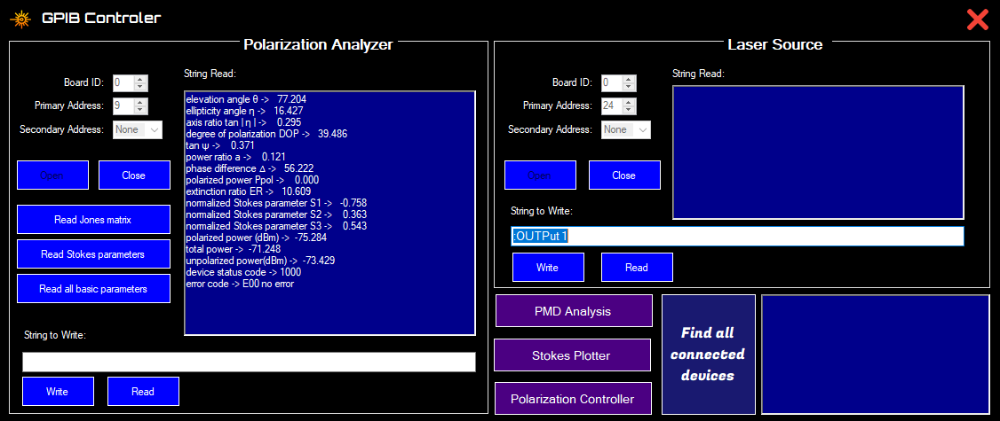
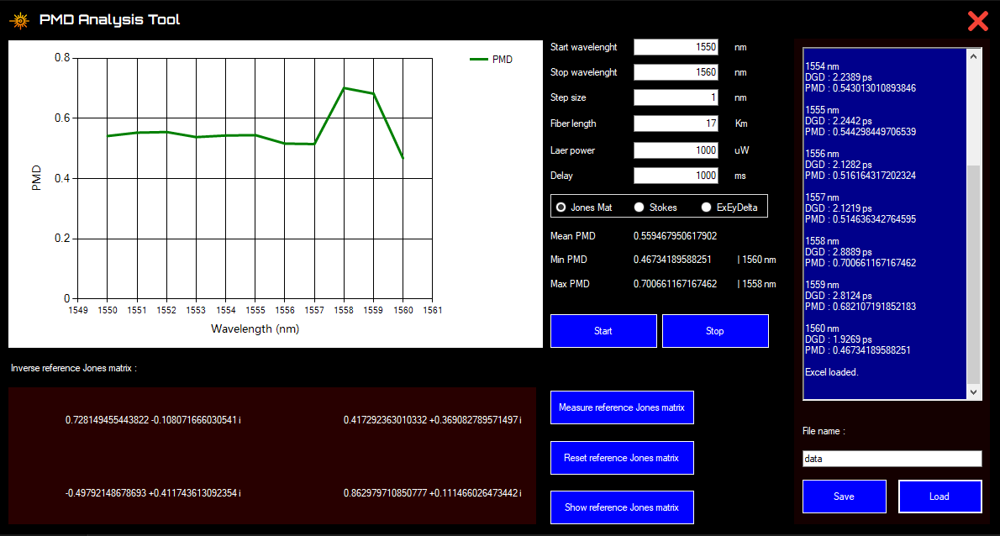
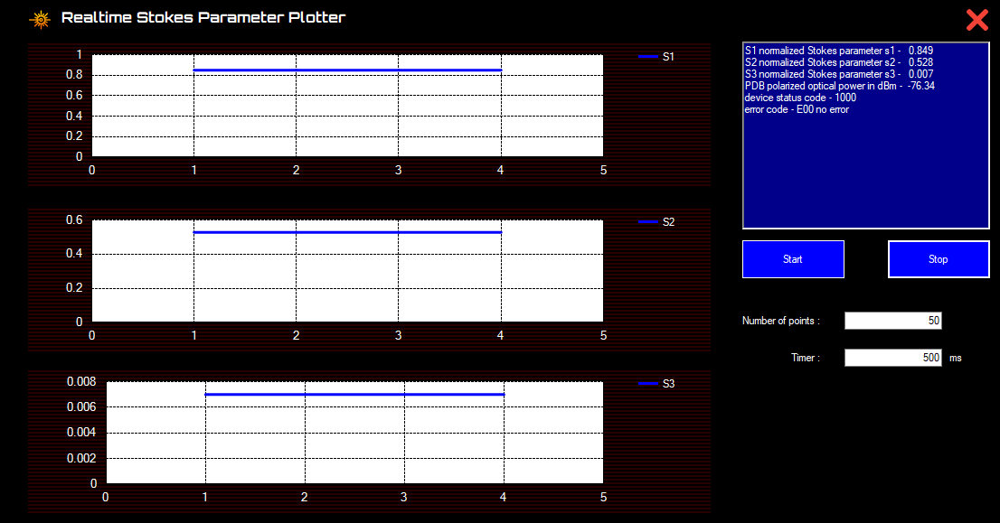
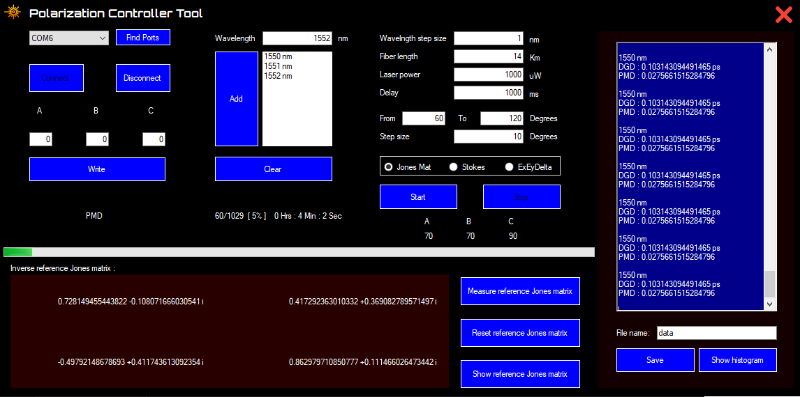
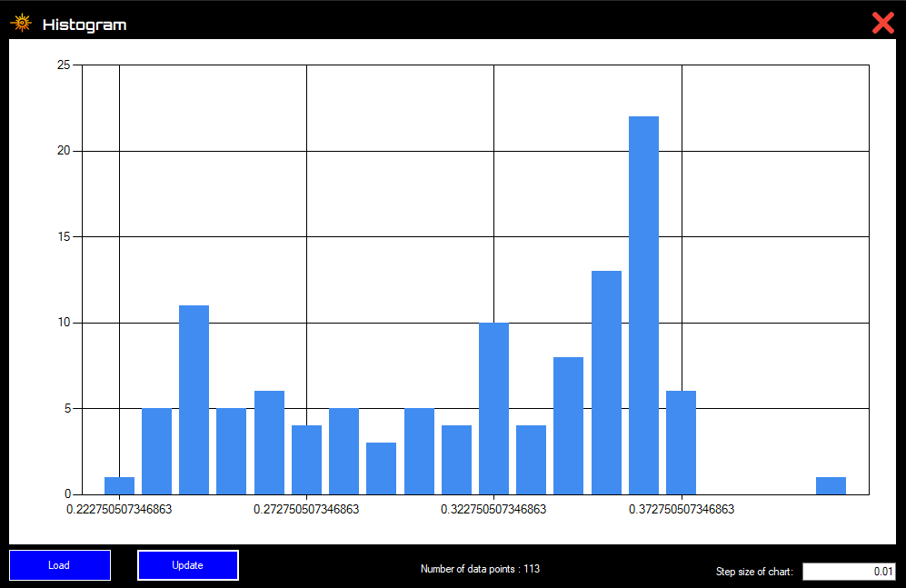

# GPIB-Controller
<h1>Test Equipment Control Software for Analysis of Polarization Mode Dispersion in Fiber Optics. ( Final Year Undergraduate Project )</h1>

Design a simple GUI and implement functionalities for connecting with multiple test equipment (Laser source and polarimeter) through the GPIB Bus and communicate with equipment using National Instruments API, connect with implemented polarization controller through the USB interface and algorithm for find polarization mode dispersion with jones matrix eigenanalysis and characterize the PMD profile of given fiber cable.

